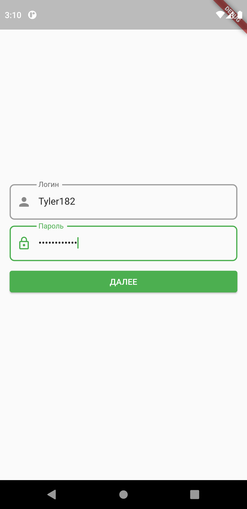
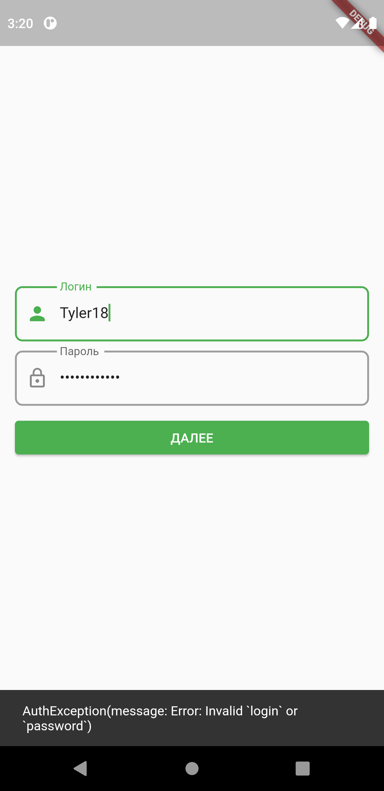
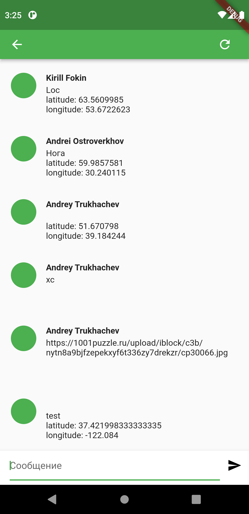

# День 1

### Задание 1. Интерфейс

Реализован пользовательский интерфейс экрана авторизации.

### Задание 2. Логика

Реализована логика авторизации, перехода на экран чата в случае успешной авторизации.

Реализовано сохранение токена с использованием shared_preferences.

var prefs = await SharedPreferences.getInstance();

await prefs.setString('token', token.token);

### Задание 3. Снекбар

Реализовано отображение SnackBar при ошибке.

## Чат. Рефакторинг

### Задание 1. Сообщение геолокации

Реализовано отображение `ChatMessageGeolocationDto`.

### Задание 3. Отправка геолокации 🔥

Реализована отправка координат в сообщение с использованием geolocator.

